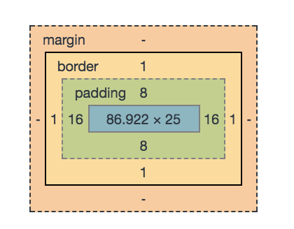

Basic structure
-------------------

```css
selector {
  property : value;
  property : value;

}
```

### selector examples : 
`p` - paragraph html tag `<p></p>`
`.style1` - html tag has a style1 class e.g. `<p class="style1"></p>`
`#id1`  - html tag has a id1 identifier e.g. `<p id="id1"></p>`

combination
```css
p.style1

p#id1

#id1.style1

p#id1.style1 
```

settings for several

`h1, h2, p {}`

cascade

`div p {}`

`div > p {}`


Where is the style defined
--------------------------

1. External style sheet
  separate file
```html
<link rel="stylesheet" type="text/css" href="mystyle.css">
```

mystyle.css:
```css
body {
  background-color: lightblue;
}

h1 {
    color: navy;
    margin-left: 20px;
}
```

2. Internal style sheet
```html 
<head>
<style>
body {
    background-color: linen;
}

h1 {
    color: maroon;
    margin-left: 40px;
} 
</style>
</head>
```

3. Inline style

```html
<p style="background:red;"></p>
```


Colors
------ 

1. using constans
```css
color:Tomato
border:2px solid Tomato;
```
2. using color code

try out here
[color mixer](https://www.w3schools.com/css/css_colors.asp)

```html
<h1 style="background-color:rgb(255, 99, 71);">...</h1>
<h1 style="background-color:#ff6347;">...</h1>
<h1 style="background-color:hsl(9, 100%, 64%);">...</h1>

<h1 style="background-color:rgba(255, 99, 71, 0.5);">...</h1>
<h1 style="background-color:hsla(9, 100%, 64%, 0.5);">...</h1>
```


# Important properties 

Background
----------

color
```css
body {
    background-color: lightblue;
}
h1 {
    background-color: green;
}

div {
    background-color: lightblue;
}

p {
    background-color: yellow;
} 
```

Background [see here](https://www.w3schools.com/css/tryit.asp?filename=trycss_background-image)
```css
body {
    background-image: url("paper.gif");

    background-repeat: repeat-x;
    //or
    background-repeat: no-repeat;
    background-position: right top;

}
```
[see here](https://www.w3schools.com/css/tryit.asp?filename=trycss_background-image_attachment) 

Border
------

```css

p.one {
    border-style: solid;
    border-color: red;
}

p {
    border-top-style: dotted;
    border-right-style: solid;
    border-bottom-style: dotted;
    border-left-style: solid;
}

p {
    border: 5px solid red;
}

p {
    border: 2px solid red;
    border-radius: 5px;
}

```


Padding-Margin
---------------
model




```css

p {
    margin-top: 100px;
    margin-bottom: 100px;
    margin-right: 150px;
    margin-left: 80px;
}

p {
    margin: 25px 50px 75px 100px;
}

p {
    margin: 25px 50px 75px;
}

p {
    margin: 25px 50px;
}

p {
    margin: 25px;
}


div {
    padding-top: 50px;
    padding-right: 30px;
    padding-bottom: 50px;
    padding-left: 80px;
}

//etc..

div {
    padding: 25px;
}
```

Size
----
```css
div {
    height: 200px;
    width: 50%;
    background-color: powderblue;
}
```


Text
-----


Fonts
-----

Icons
-----

Links
-----

Lists
-----

Tables
------

Opacity - Display
------------------

Align
------


Websites layout
================

[see here](https://www.w3schools.com/css/css_website_layout.asp)


